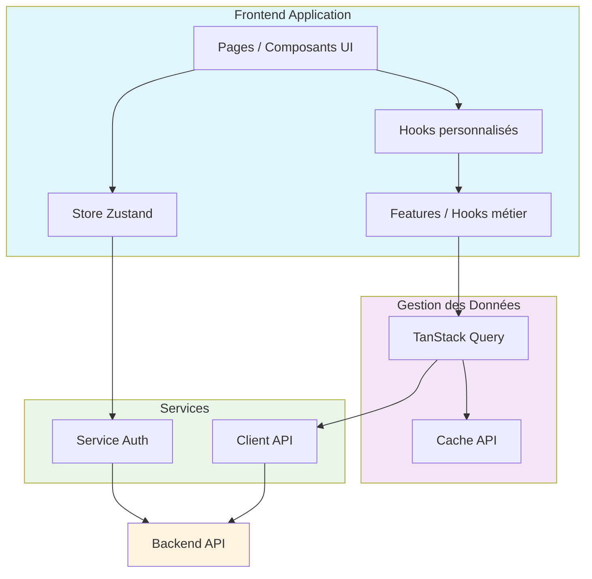
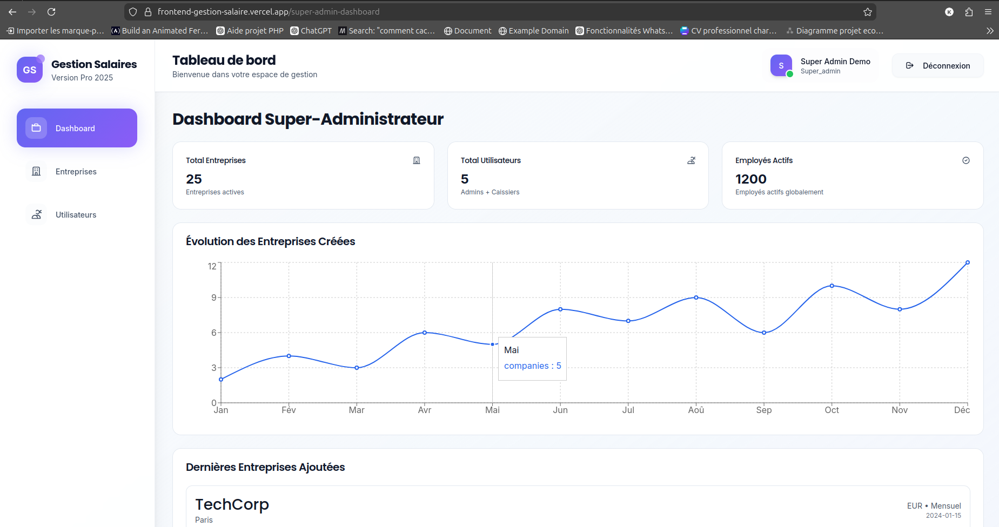
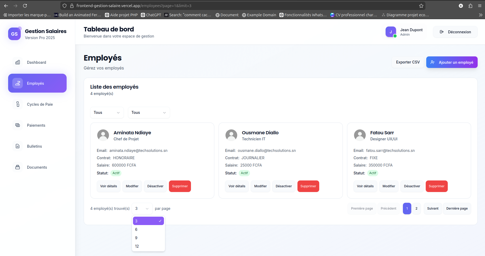
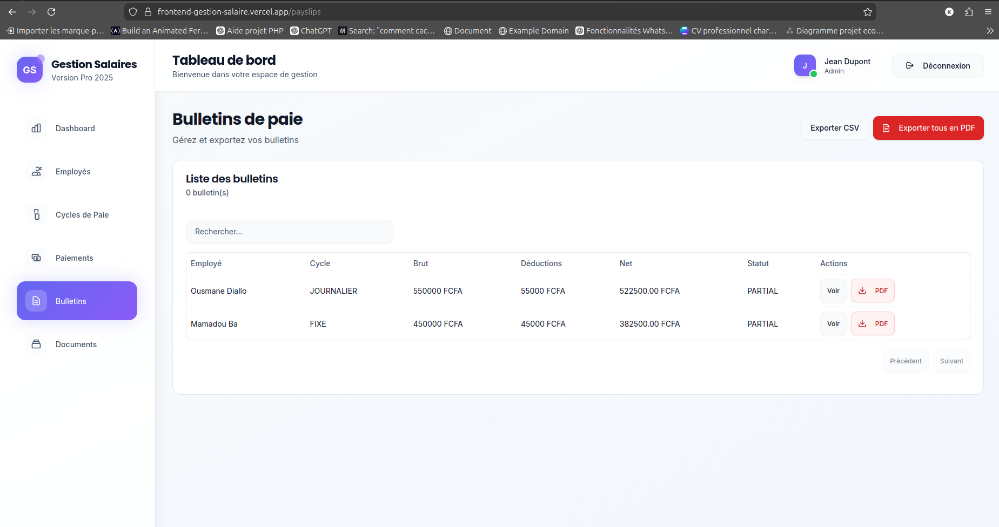

# 🚀 Application de Gestion des Salaires - Frontend

[](https://reactjs.org/)
[](https://www.typescriptlang.org/)
[](https://vitejs.dev/)
[](https://tailwindcss.com/)
[](https://vercel.com/)

Application web frontend de gestion des salaires multi-entreprises, développée selon les principes **SOLID** et **DRY**. Cette application permet aux entreprises de gérer efficacement leurs employés, leurs cycles de paie, les bulletins de salaire et les paiements.

**Déployé sur :** [https://frontend-gestion-salaire.vercel.app](https://frontend-gestion-salaire.vercel.app)

---

## 📋 Table des Matières

1. [Objectif du projet](#1-objectif-du-projet)
2. [Description fonctionnelle](#2-description-fonctionnelle)
3. [Stack technique](#3-stack-technique)
4. [Architecture frontend](#4-architecture-frontend)
5. [Communication avec le backend](#5-communication-avec-le-backend)
6. [Installation et lancement](#6-installation-et-lancement)
7. [Déploiement](#7-déploiement)
8. [Captures d'écran](#8-captures-décran)
9. [Choix techniques et bonnes pratiques](#9-choix-techniques-et-bonnes-pratiques)
10. [Améliorations futures](#10-améliorations-futures)
11. [Auteur](#11-auteur)

---

## 1. Objectif du projet

### Rôle du frontend dans le système de gestion de salaire

Le frontend constitue l'interface utilisateur principale du système de gestion de salaire. Il permet aux utilisateurs d'interagir avec les données stockées dans le backend sans avoir besoin de connaissances techniques. L'application fournit une expérience utilisateur moderne, réactive et accessible pour gérer l'ensemble des aspects de la paie d'une entreprise.

### Problèmes utilisateurs résolus

Cette application résout plusieurs problématiques rencontrées par les entreprises dans la gestion de leurs salaires :

- **Visualisation centralisée** : Un tableau de bord consolidé affichant les KPIs essentiels (nombre d'employés, masse salariale, paiements en attente)
- **Gestion des employés** : CRUD complet avec recherche, filtrage et pagination pour gérer efficacement les fiches employé
- **Gestion des cycles de paie** : Création et suivi des périodes de paie avec génération automatique des bulletins
- **Suivi des paiements** : Enregistrement et traçabilité de tous les paiements effectués
- **Export des documents** : Génération de PDFs pour les bulletins de salaire et les reçus de paiement
- **Gestion multi-entreprises** : Support de plusieurs entreprises au sein d'une même plateforme (rôles différenciés)

### Public cible

- **Super Administrateurs** : Gestion complète de la plateforme, administration des entreprises
- **Administrateurs RH** : Gestion des employés, création des cycles de paie, approbation des bulletins
- **Comptables/Caissiers** : Enregistrement des paiements, génération des reçus
- **Employés** : Consultation de leurs propres bulletins de salaire

---

## 2. Description fonctionnelle

### Authentification et sécurité

- **Connexion/Déconnexion** : Système d'authentification avec email et mot de passe
- **Gestion des sessions** : Stockage sécurisé du token JWT avec expiration automatique
- **Routes protégées** : Accès restreint aux pages selon le rôle de l'utilisateur
- **Redirection automatique** : Vers le tableau de bord approprié selon le rôle

### Tableau de bord (Dashboard)

- **Indicateurs clés (KPIs)** : Nombre total d'employés, masse salariale, paiements en attente
- **Graphiques d'évolution** : Visualisation de l'évolution sur les 6 derniers mois
- **Widget d'activité récente** : Dernières actions performed sur la plateforme
- **Mise à jour en temps réel** : Données synchronisées avec le backend

### Gestion des employés

- **Liste paginée** : Affichage avec pagination, tri et recherche
- **Création d'employés** : Formulaire avec validation des données
- **Modification des fiches** : Mise à jour des informations employé
- **Activation/Désactivation** : Gestion du statut actif/inactif
- **Détails complets** : Visualisation de toutes les informations d'un employé

### Gestion des salaires

- **Cycles de paie** : Création et gestion des périodes de paie
- **Génération automatique** : Création des bulletins pour tous les employés d'un cycle
- **Approbation** : Workflow d'approbation des bulletins avant paiement
- **Bulletins de salaire** : Consultation détaillée avec historique
- **Export PDF** : Génération des bulletins au format PDF

### Gestion des paiements

- **Enregistrement des paiements** : Saisie des paiements avec sélection du bulletin
- **Suivi des paiements** : Liste complète avec statut (en attente, effectué)
- **Génération de reçus** : Création automatique des reçus au format PDF
- **Filtres avancés** : Recherche par date, employé, statut

### Gestion des documents

- **Archives des bulletins** : Accès à tous les bulletins générés
- **Export CSV** : Extraction des données au format表格 pour analyse
- **Reçus de paiement** : Téléchargement des reçus

### Rôles et permissions

| Fonctionnalité | SUPER_ADMIN | ADMIN | CASHIER | EMPLOYEE |
|----------------|-------------|-------|---------|----------|
| Dashboard | ✅ | ✅ | ✅ | Limité |
| Gestion employés | ✅ | ✅ | ❌ | ❌ |
| Cycles de paie | ✅ | ✅ | ❌ | ❌ |
| Bulletins | ✅ | ✅ | ✅ | Ses bulletins |
| Paiements | ✅ | ✅ | ✅ | ❌ |
| Documents | ✅ | ✅ | ✅ | Ses documents |

---

## 3. Stack technique

### Framework et langage

| Technologie | Version | Choix |
|-------------|---------|-------|
| **React** | 19 | Framework JavaScript moderne avec hooks pour une gestion d'état puissante et flexible |
| **TypeScript** | 5.0 | Typage statique pour une meilleure maintenabilité, détection des erreurs à la compilation |

**Pourquoi React 19 ?** React 19 apporte des améliorations significatives en termes de performances avec le nouveau compilateur et les actions serveur. L'écosystème mature et la grande communauté facilitent le développement et la résolution de problèmes.

**Pourquoi TypeScript ?** Le typage statique permet de détecter les erreurs plus tôt dans le cycle de développement, améliore l'autocomplétion dans l'IDE et sert de documentation vivante pour le code.

### Outils de build et développement

| Technologie | Version | Choix |
|-------------|---------|-------|
| **Vite** | 6.0 | Build ultra-rapide avec HMR (Hot Module Replacement) pour un développement fluide |
| **ESLint** | 9.0 | Linting du code avec règles strictes pour garantir la qualité et la cohérence |

**Pourquoi Vite ?** Vite utilise esbuild pour le développement (10-100x plus rapide que webpack) et Rollup pour la production. Le Hot Module Replacement est instantané, ce qui améliore considérablement l'expérience développeur.

### Style et composants UI

| Technologie | Version | Choix |
|-------------|---------|-------|
| **Tailwind CSS** | 3.4 | Framework CSS utilitaire pour un styling rapide, cohérent et personnalisable |
| **shadcn/ui** | Latest | Composants UI accessibles, personnalisables et basés sur Radix UI |

**Pourquoi Tailwind CSS ?** L'approche utilitaire permet un développement rapide sans créer de nombreux fichiers CSS. La cohérence visuelle est assurée via la configuration des couleurs et spacing. Le bundle final est optimisé grâce au tree shaking.

**Pourquoi shadcn/ui ?** Composants accessibles (WCAG), hautement personnalisables via Tailwind, pas de dépendance externe lourde. Le code source est directement inclus dans le projet pour un contrôle total.

### Gestion des données et état

| Technologie | Version | Choix |
|-------------|---------|-------|
| **TanStack Query** | 5.0 | Gestion optimisée des requêtes API avec cache intelligent et synchronisation |
| **Zustand** | 5.0 | Store léger pour l'état global (authentification) |

**Pourquoi TanStack Query ?** Gestion automatique du cache, invalidation intelligente, retry automatique en cas d'erreur, loading states intégrés. Réduit considérablement le code boilerplate pour les appels API.

**Pourquoi Zustand ?** Alternative légère à Redux avec une API simple et intuitive. Parfait pour gérer l'état d'authentification sans la complexité de Redux.

### Routing et formulaires

| Technologie | Version | Choix |
|-------------|---------|-------|
| **React Router** | 6.4 | Routing moderne avec nested routes et data loading |
| **React Hook Form** | 7.0 | Gestion des formulaires avec performance optimisée |
| **Zod** | 3.0 | Validation des schémas avec inférence de types |

### Tableaux et graphiques

| Technologie | Version | Choix |
|-------------|---------|-------|
| **TanStack Table** | 8.0 | Tableaux avancés avec pagination, tri, filtrage et colonnes définies |
| **Recharts** | 2.0 | Graphiques interactifs et responsives pour le dashboard |

### Déploiement

| Technologie | Choix |
|-------------|-------|
| **Vercel** | Plateforme de déploiement native pour les applications React/Vite, CI/CD intégré |

---

## 4. Architecture frontend

### Organisation des dossiers

```
src/
├── api/                    # Couche d'abstraction pour les appels API
│   ├── auth.js            # Endpoints d'authentification
│   ├── client.js          # Configuration du client HTTP
│   ├── dashboard.js       # Endpoints du dashboard
│   ├── employees.js       # Endpoints des employés
│   ├── payruns.js         # Endpoints des cycles de paie
│   ├── payslips.js        # Endpoints des bulletins
│   ├── payments.js        # Endpoints des paiements
│   ├── documents.js       # Endpoints des documents
│   ├── companies.js       # Endpoints des entreprises
│   ├── users.js           # Endpoints des utilisateurs
│   └── attendance.js      # Endpoints des présences
│
├── components/            # Composants réutilisables
│   ├── Layout.jsx        # Layout principal avec navigation
│   ├── ProtectedRoute.jsx # Route protégée avec auth
│   ├── ErrorBoundary.jsx # Gestion des erreurs React
│   ├── Spinner.jsx       # Indicateur de chargement
│   └── ui/               # Composants UI (shadcn/ui)
│       ├── button.jsx
│       ├── card.jsx
│       ├── table.jsx
│       ├── dialog.jsx
│       ├── form.jsx
│       ├── input.jsx
│       ├── select.jsx
│       ├── tabs.jsx
│       ├── badge.jsx
│       └── label.jsx
│
├── pages/                 # Pages principales de l'application
│   ├── Login.jsx         # Page de connexion
│   ├── Dashboard.jsx     # Tableau de bord principal
│   ├── Employees.jsx     # Gestion des employés
│   ├── EmployeeDetails.jsx
│   ├── CreateEmployeeDialog.jsx
│   ├── PayRuns.jsx       # Gestion des cycles de paie
│   ├── Payslips.jsx      # Gestion des bulletins
│   ├── Payments.jsx      # Gestion des paiements
│   ├── Documents.jsx     # Gestion des documents
│   ├── Companies.jsx     # Gestion des entreprises
│   ├── Users.jsx         # Gestion des utilisateurs
│   ├── Register.jsx      # Page d'inscription
│   ├── Kiosk.jsx         # Mode kiosk
│   └── QRScanner.jsx     # Scanner QR code
│
├── features/              # Code organisé par fonctionnalité
│   ├── companies/
│   │   └── hooks/
│   │       └── useCompanies.js
│   ├── employees/
│   │   └── hooks/
│   │       └── useEmployees.js
│   └── users/
│       └── hooks/
│           └── useUsers.js
│
├── hooks/                 # Hooks personnalisés
│   └── usePWA.js         # Hook pour les fonctionnalités PWA
│
├── providers/            # Context providers
│   └── QueryProvider.jsx # Provider React Query
│
├── store/                # État global (Zustand)
│   └── auth.js          # Store d'authentification
│
├── lib/                  # Utilitaires
│   └── utils.js         # Fonctions utilitaires (cn pour Tailwind)
│
├── validators/           # Validateurs Zod
│   └── employeeValidator.js
│
├── utils/                # Utilitaires métier
│   ├── csvExporter.js   # Export CSV
│   ├── employees.jsx
│   └── ErrorHandler.jsx
│
├── config/              # Configuration
│   └── app.js
│
├── App.jsx              # Point d'entrée routing
├── main.jsx             # Point d'entrée React
├── index.css            # Styles globaux
└── App.css              # Styles App
```

### Schéma d'architecture



### Séparation des responsabilités

- **Pages** : Responsables de l'affichage et de la coordination
- **Composants** : UI réutilisables sans logique métier
- **Hooks métier** : Logique de récupération et mutation des données
- **API** : Communication avec le backend
- **Store** : État global (authentification)
- **Utils** : Fonctions utilitaires et helpers

---

## 5. Communication avec le Backend

### Configuration du client HTTP

Le client API est configuré dans [`src/api/client.js`](src/api/client.js) avec les fonctionnalités suivantes :

```javascript
// Configuration de base avec axios
const api = axios.create({
  baseURL: import.meta.env.VITE_API_URL || 'http://localhost:3000',
  timeout: 15000,
  headers: {
    'Content-Type': 'application/json',
  },
});
```

### Intercepteurs de requêtes

**Intercepteur de requête** : Ajoute automatiquement le token JWT aux headers :

```javascript
api.interceptors.request.use(
  (config) => {
    const token = authStore.getState().token;
    if (token) {
      config.headers.Authorization = `Bearer ${token}`;
    }
    return config;
  },
  (error) => Promise.reject(error)
);
```

**Intercepteur de réponse** : Gestion centralisée des erreurs :

```javascript
api.interceptors.response.use(
  (response) => response,
  (error) => {
    if (error.response?.status === 401) {
      authStore.getState().logout();
      window.location.href = '/login';
    }
    return Promise.reject(error);
  }
);
```

### Gestion des requêtes avec TanStack Query

Utilisation des hooks personnalisés pour chaque entité :

```javascript
// Exemple d'utilisation
const { data, isLoading, error } = useEmployees({ page: 1, limit: 10 });
const mutation = useCreateEmployee();
```

Avantages :
- Cache intelligent avec invalidation automatique
- Loading states intégrés
- Retry automatique en cas d'erreur
- Synchronisation des données en arrière-plan

### Gestion des erreurs

- **Erreurs réseau** : Affichage d'un message convivial avec possibilité de réessayer
- **Erreurs d'authentification** : Déconnexion automatique et redirection vers login
- **Erreurs de validation** : Affichage des erreurs sous les champs de formulaire
- **Error Boundary** : Capture des erreurs React pour éviter le crash de l'application

### Sécurité côté client

- **Stockage du token** : LocalStorage avec expiration
- **Headers de sécurité** : Content-Type, Authorization
- **Validation des données** : Zod pour valider les entrées utilisateur
- **Sanitization** : Échappement des données affichées

---

## 6. Installation et lancement

### Prérequis

- **Node.js** : Version 18 ou supérieure
- **npm** : Version 9 ou supérieure (ou yarn/pnpm)
- **Backend** : L'application backend doit être en cours d'exécution

### Étape 1 : Cloner le repository

```bash
# Cloner le repository
git clone https://github.com/KalidouGUISSE/-frontend-Gestion-Salaire.git

# Accéder au dossier frontend
cd -frontend-Gestion-Salaire
```

### Étape 2 : Installer les dépendances

```bash
# Installation avec npm
npm install

# Ou avec yarn
yarn install

# Ou avec pnpm
pnpm install
```

### Étape 3 : Configuration des variables d'environnement

```bash
# Copier le fichier d'exemple
cp .env.example .env.local

# Éditer le fichier avec vos valeurs
nano .env.local
```

Variables d'environnement disponibles :

```env
# URL du backend API
VITE_API_URL=http://localhost:3000

# Timeout des requêtes (ms)
VITE_API_TIMEOUT=15000

# Nom de l'application
VITE_APP_NAME="Gestion des Salaires"

# Version de l'application
VITE_APP_VERSION=1.0.0

# Environnement
VITE_APP_ENVIRONMENT=development

# Activation des fonctionnalités
VITE_ENABLE_ANALYTICS=false
VITE_ENABLE_ERROR_TRACKING=false
```

### Étape 4 : Lancement en local

```bash
# Mode développement avec HMR
npm run dev
```

L'application sera accessible sur `http://localhost:5173`

### Étape 5 : Build de production

```bash
# Build de production
npm run build

# Prévisualisation du build
npm run preview
```

### Scripts disponibles

| Commande | Description |
|----------|-------------|
| `npm run dev` | Serveur de développement avec HMR |
| `npm run build` | Build de production optimisé |
| `npm run preview` | Prévisualisation du build local |
| `npm run lint` | Vérification du code avec ESLint |
| `npm run lint:fix` | Correction automatique des erreurs |

---

## 7. Déploiement

### Déploiement sur Vercel

L'application est déployée sur Vercel, plateforme optimisée pour les applications React/Vite.

**Lien de déploiement :** [https://frontend-gestion-salaire.vercel.app](https://frontend-gestion-salaire.vercel.app)

### Configuration Vercel

Le fichier [`vercel.json`](vercel.json) configure le rewrites pour la gestion des routes SPA :

```json
{
  "rewrites": [
    {
      "source": "/(.*)",
      "destination": "/index.html"
    }
  ]
}
```

### Processus de déploiement automatique

1. **Push sur la branche principale** : Déclenche automatiquement le déploiement
2. **Build** : Vercel exécute `npm run build`
3. **Déploiement** : L'application est déployée sur le CDN global de Vercel
4. **Preview** : Chaque pull request génère un lien de preview

### Bonnes pratiques appliquées

- **Variables d'environnement** : Configurées dans l'interface Vercel
- **Cache des dépendances** : Optimisation des temps de build
- **Compression** : Gzip/Brotli activé automatiquement
- **CDN global** : Distribution mondiale des assets

### Déploiement manuel

```bash
# Build de l'application
npm run build

# Installation de Vercel CLI
npm i -g vercel

# Déploiement
vercel --prod
```

---

## 8. Captures d'écran

### 📊 Tableau de bord – Super Admin


Vue globale des indicateurs clés :
- Nombre total d’employés
- Masse salariale
- Paiements en attente
- Statistiques globales multi-entreprises

---

### 👥 Gestion des employés


Interface dédiée à la gestion des employés :
- Liste paginée avec recherche
- Création et modification des fiches employé
- Activation / désactivation
- Accès aux détails complets

---

### 🧾 Bulletin de paie


Consultation détaillée des bulletins de salaire :
- Détails du salaire brut et net
- Historique des paiements
- Téléchargement du bulletin en PDF


## 9. Choix techniques et bonnes pratiques

### Pourquoi cette architecture ?

L'architecture została conçue pour répondre à plusieurs objectifs :

1. **Scalabilité** : La structure modulaire permet d'ajouter de nouvelles fonctionnalités sans impacter l'existant
2. **Maintenabilité** : La séparation claire des responsabilités facilite les mises à jour et corrections
3. **Testabilité** : Chaque couche peut être testée indépendamment
4. **Performance** : Le lazy loading et le code splitting optimisent le bundle initial

### Organisation du code

**Séparation des préoccupations (Separation of Concerns)** :

- **API layer** : Abstraction des appels HTTP
- **Business logic** : Hooks métier réutilisables
- **UI layer** : Composants purement présentationnels
- **State management** : Zustand pour l'authentification, TanStack Query pour les données serveur

### Réutilisabilité des composants

Les composants UI sont isolés dans [`src/components/ui/`](src/components/ui/) et utilisent shadcn/ui comme base. Ils sont :

- **Paramétrables** : Props pour personnaliser l'apparence
- **Accessibles** : Respect des standards WCAG
- **Thémables** : Personnalisables via Tailwind CSS
- **Testables** : Composants purs facile à tester

### Lisibilité et maintenabilité

- **Convention de nommage** : Composants en PascalCase, hooks en camelCase
- **Typage TypeScript** : Interfaces explicites pour les données
- **Documentation** : Comments pour les fonctions complexes
- **Formatage** : ESLint et Prettier pour la cohérence

### Bonnes pratiques frontend appliquées

| Pratique | Implémentation |
|----------|---------------|
| **Lazy Loading** | Routes chargées dynamiquement avec `React.lazy` |
| **Code Splitting** | Bundle séparé par vendor et route |
| **Error Boundary** | [`ErrorBoundary.jsx`](src/components/ErrorBoundary.jsx) pour capturer les erreurs |
| **Semantic HTML** | Navigation, sections, headings appropriés |
| **Accessibility** | Attributs ARIA, navigation clavier |
| **Performance** | Cache React Query, optimisations Vite |
| **Type Safety** | TypeScript pour toutes les données |

---

## 10. Améliorations futures

### Fonctionnalités prévues

- [ ] **Mode hors ligne** : Support PWA complet avec Service Worker
- [ ] **Notifications push** : Alertes pour les événements importants
- [ ] **Mode sombre** : Support du thème sombre
- [ ] **Multi-langues** : Support de l'anglais et du wolof
- [ ] **Rapports avancés** : Tableaux de bord personnalisables
- [ ] **Import/Export** : Import massif d'employés, export PDF amélioré

### Améliorations UX/UI

- [ ] **Animations** : Transitions fluides entre les pages
- [ ] **Skeleton loading** : Indicateurs de chargement squelettiques
- [ ] **Drag & Drop** : Réorganisation des colonnes dans les tableaux
- [ ] **Vue mobile** : Optimisation tablette et smartphone
- [ ] **Breadcrumbs** : Navigation structurelle améliorée

### Optimisations techniques

- [ ] **Tests unitaires** : Couverture avec React Testing Library
- [ ] **Tests E2E** : Tests avec Cypress ou Playwright
- [ ] **Bundle optimization** : Analyse et réduction du bundle
- [ ] **Server Components** : Migration vers React Server Components
- [ ] **CDN images** : Optimisation des images avec lazy loading

### Infrastructure

- [ ] **CI/CD** : Pipeline complet avec GitHub Actions
- [ ] **Monitoring** : Intégration Sentry pour les erreurs
- [ ] **Analytics** : Suivi de l'utilisation avec Google Analytics
- [ ] **Docker** : Conteneurisation pour déploiement flexible

---

## 11. Auteur

| | |
|---|---|
| **Nom** | Kalidou Guissé |
| **Rôle** | Développeur Frontend |
| **GitHub** | [https://github.com/KalidouGUISSE](https://github.com/KalidouGUISSE) |
| **Repository** | [https://github.com/KalidouGUISSE/-frontend-Gestion-Salaire](https://github.com/KalidouGUISSE/-frontend-Gestion-Salaire) |

---

<div align="center">

**🚀 Développé avec React, TypeScript et ❤️**

</div>
